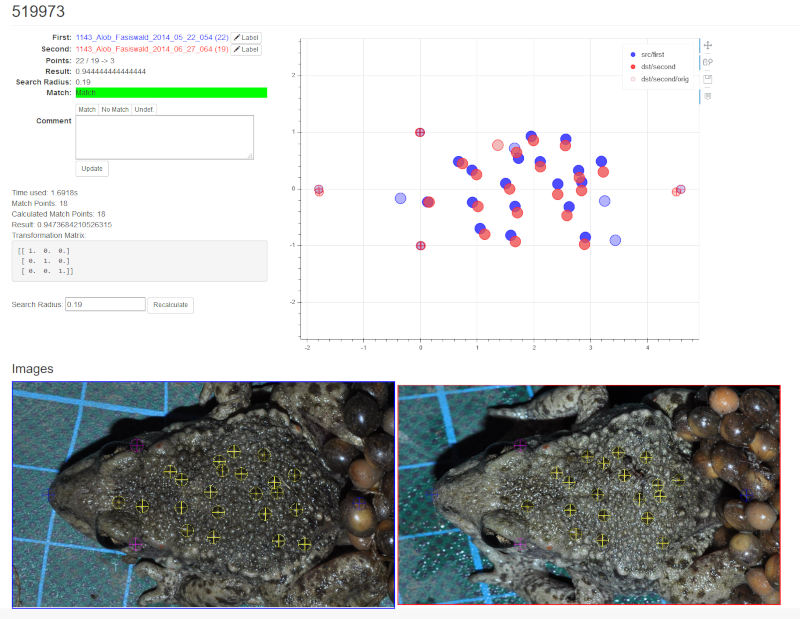
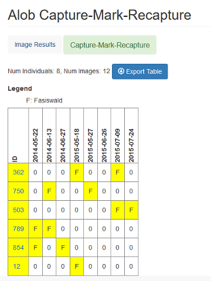

# Alytes obstetricans obstetricans - Pattern Recognition

Alytes obstetricans obstetricans warts are unique and can be used to identify an individual.
Compare the two point clouds of warts to decide if the image shows the same individual.

### Compare 2 images

### Capture-Mark-Recapture

## About

[About (german)](doc/source/about.rst)

## Getting Started

[Getting Started (german)](doc/source/getting_started.rst)

## Installation and Deployment

* Instruction to setup the Alob-Server can be found in [Deployment](doc/source/deploy.rst).
* Instruction for setup on local machine for testing and development: [Devel](doc/source/deploy.rst)

## Prerequisites

List of software used:

[Software](doc/source/software.rst)

## Demo

To be setup